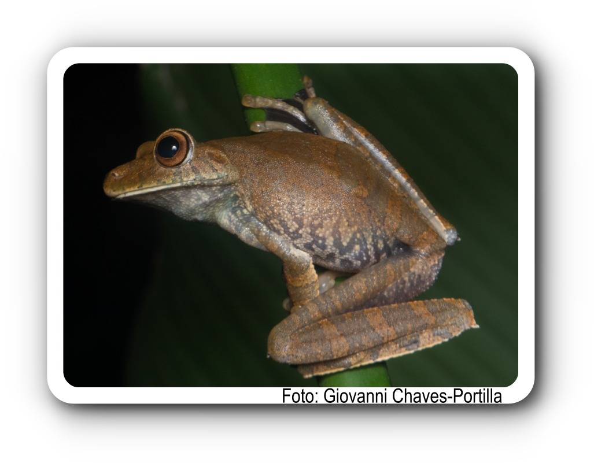
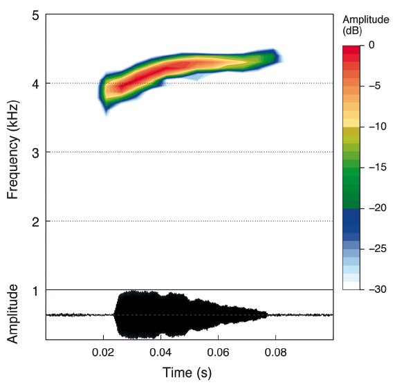

    <h1><i>Boana boans</i></h1>
    

    
Los audios y tablas corresponden a la publicación:

<strong>Marín, C.M., C. Molina-Zuluaga, A. Restrepo, E.Cano & J.M. Daza.</strong> 2018. A new species of <i>Leucostethus</i> (Anura: Dendrobatidae) from the eastern versant of the Central Cordillera of Colombia with comments on the phylogenetic position of <i>Colostethus fraterdanieli</i>. <i>Zootaxa</i> 4461: 359--380. <a href="https://doi.org/10.11646/zootaxa.4461.3.3">https://doi.org/10.11646/zootaxa.4461.3.3</a>

contacto: Carlos M. Marín (), Juan M. Daza (juanm.daza@udea.edu.co)

  <button class="tablinks" onclick="openTab(event, 'EspectroBobo')">Espectrograma</button>
  <button class="tablinks" onclick="openTab(event, 'tabBobo')">Tablas</button>
  <button class="tablinks" onclick="openTab(event, 'audBobo')">Audios</button>

  <!-- Centering the video -->
  <video width="100%" height="auto" controls style="display: block; margin-left: auto; margin-right: auto;">
    <source src="Espectrograms/Boana_boans.mp4" type="video/mp4">
    Tu navegador no soporta el elemento de video.
  </video>

  <!-- Adding two line spaces between the video and the image -->
    

  <!-- Centering the image -->
  

  
Descarga tabla de medidas <a href="https://bit.ly/3LUkN5s">aquí</a>.

  
Descarga tabla selección RAVEN <a href="https://bit.ly/3LUkN5s">aquí</a>.

  <h3>Audios</h3>
  

    <audio controls>
      <source src="Boana_boans.wav" type="audio/wav">
      Tu navegador no soporta el elemento de audio.
    </audio>
  

  
Más audios disponibles <a href="https://bit.ly/3LUkN5s">aquí</a>.

