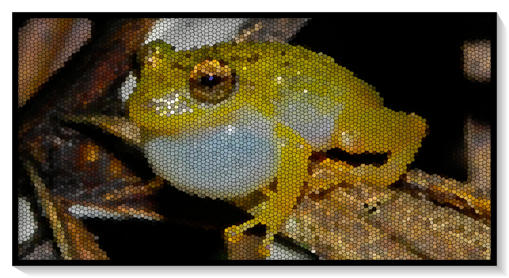

    <h1>SONIDOS DE LOS ANFIBIOS DE COLOMBIA</h1>
    

## Introducción

Este sitio permite visibilizar y disponibilizar los datos asociados a los cantos de anuncio publicados de especies en Colombia. Los datos corresponden a los audios, las medidas realizadas por los investigadores y las tablas de selección generadas en el paquete [Raven](https://store.birds.cornell.edu/collections/raven-sound-software).

Estos recursos buscan varios objetivos dado que permiten:

1.  La reproducibilidad de los resultados obtenidos en descripciones de cantos.

2.  Ser utilizados para nuevas descripciones y estudios comparativos.

3.  Ser utilizados en el entrenamiento de algoritmos para la detección automática de especies.

4.  Apoyar cursos y prácticas en Bioacústica y Ecoacústica.

## Contribuidores

Diseño:

[Juan M. Daza](juanm.daza@udea.edu.co)

Programación:

[Maria J. Guerrero](mariaj.guerrero@udea.edu.co), Juan M. Daza

Contribuidores:

[Mauricio Rivera](mauricio.rivera1@udea.edu.co) (Pristimantis dorsopictus, Pristimantis cryptopictus)

# HYLIDAE

- [Boana boans](Boana_boans.md)
- [Dendropsophus phlebodes](Dendropsophus_phlebodes.md)

# LEPTODACTYLIDAE

- [Leptodactylus savagei](Leptodactylus_savagei.md)

## Otros repositorios con especies colombianas
- [Fonozoo](https://www.fonozoo.com/)
- [AnuraSet](https://soundclim.github.io/anuraweb/)
- [Colección Sonidos IAVH](http://colecciones.humboldt.org.co/sonidos/)

