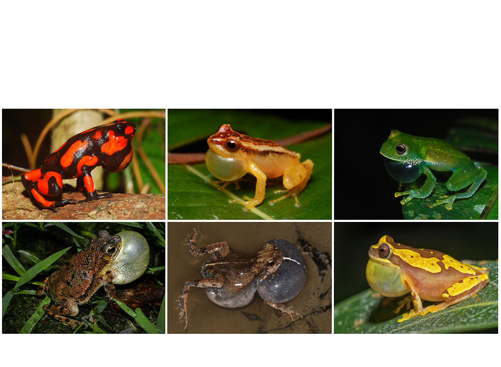
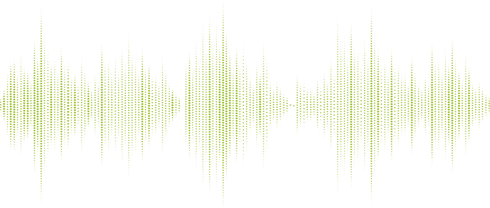

    

## Colección de Sonidos de los Anfibios de Colombia
 

Colombia posee una gran diversidad de anfibios lo que se refleja también en una inmensa riqueza de sonidos generados por estos. En la última decada ha habido un gran interés por documentar estos sonidos ([Rivera et al. 2021](https://www.go-fair.org/fair-principles/)) y la comunidad herpetológica esta aprovechando el sonido emitido por los anfibios para abordar preguntas que van desde la taxonomía, ecología y comportamiento hasta la evolución de señales y el monitoreo de la biodiversidad.

Este sitio surge, de la comunidad académica, como respuesta a este reciente interés de la comunidad herpetológica pero reconoce que la accesibilidad a los resultados de estudios acústicos con anfibios colombianos se encuentra dispersa o es de difícil acceso. Los datos aqui contenidos corresponden a los audios, las medidas realizadas por los investigadores y las tablas de selección generadas en el programa [Raven](https://store.birds.cornell.edu/collections/raven-sound-software). Este repositorio además busca:

1.  La reproducibilidad de los resultados obtenidos en descripciones de cantos.

2.  Facilitar nuevas descripciones de cantos y estudios comparativos.

3.  Facilitar archivos anotados para el entrenamiento de algoritmos de detección automática de especies.

4.  Apoyar cursos y prácticas en Bioacústica y Ecoacústica.

Nuestra principal motivación son los [principios FAIR](https://www.go-fair.org/fair-principles/) donde se busca hacer los datos digitales (e.g., archivos de sonido, tablas) facilmente encontrables, accesibles, interoperables y reutilizables por la comunidad científica y general. Así, este sitio se convierte en el primer visor en Colombia donde integra de una forma simple y eficiente la información disponible de datos acústicos obtenidos para la anurofauna del país.

Esperamos que este sitio motive a la comunidad a seguir depositando sus datos acústicos en diferentes repositorios de libre acceso. <a href="mailto:juanm.daza@udea.edu.co">escríbenos</a>

# Explorar los datos con especímen voucher
<iframe src="https://www.google.com/maps/d/u/1/embed?mid=1wxey1vq0p4rmITVp2Y2ZVbu8g8Ls0gw&ehbc=2E312F&noprof=1" width="640" height="480"></iframe>

# Explorar los datos por taxonomía
<iframe src="https://www.google.com/maps/d/u/1/embed?mid=14vULshF6ww3Tvdzq5kJU_vYbgYpHZM0&ehbc=2E312F&noprof=1" width="640" height="480"></iframe>

# Explorar los datos por repositorio
<iframe src="https://www.google.com/maps/d/u/1/embed?mid=1kB78LKzh-QpVT-uILse505TcShLkhxY&ehbc=2E312F&noprof=1" width="640" height="480"></iframe>

 
# Descarga la tabla de datos completa aquí

[versión septiembre 2024](https://www.go-fair.org/fair-principles/)

    

 
Diseño y mantenimiento: 
<a href="mailto:juanm.daza@udea.edu.co">Juan M. Daza</a>, Grupo Herpetológico de Antioquia

Programación: 
<a href="mailto:mariaj.guerrero@udea.edu.co">Maria J. Guerrero</a>, 
<a href="mailto:juanm.daza@udea.edu.co">Juan M. Daza</a>, Grupo Herpetológico de Antioquia

Contribuidores: 
<a href="mailto:mauricio.rivera1@udea.edu.co">Mauricio Rivera</a>, Grupo Herpetológico de Antioquia 
