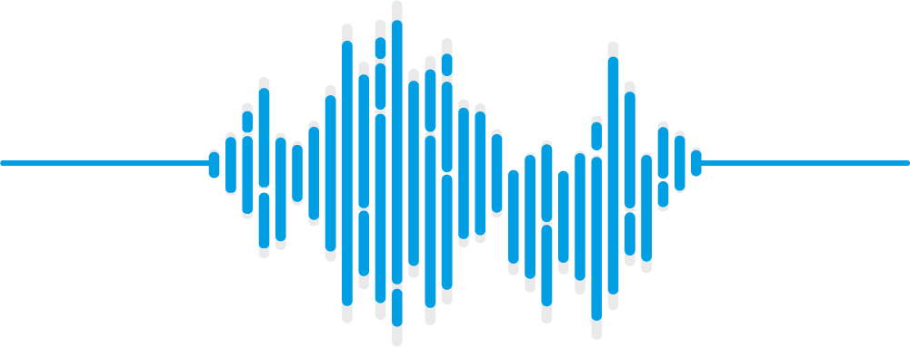

    

# Dataverso de Sonidos de Anfibios Colombianos

Colombia, con una gran diversidad de anfibios, resulta en una inmensa riqueza de sonidos generados por estos. En la última decada ha habido un gran interés por documentar estos sonidos ([Rivera-Correa et al. 2021](https://www.tandfonline.com/doi/full/10.1080/23766808.2021.1957651)) y la comunidad herpetológica esta aprovechando el sonido emitido por los anfibios para abordar preguntas que van desde la taxonomía, ecología y comportamiento hasta la evolución de señales y el monitoreo de la biodiversidad.

Este sitio surge, desde la comunidad académica, como respuesta al reciente interés de la comunidad herpetológica pero reconoce que la accesibilidad a los resultados de estudios acústicos con anfibios colombianos se encuentra dispersa o es de difícil acceso y uso. Los datos aqui contenidos corresponden a los audios, las medidas realizadas por los investigadores y las tablas de selección generadas en diferentes programas  (e.g. [Raven](https://store.birds.cornell.edu/collections/raven-sound-software)). Este sitio busca además:

1. La reproducibilidad de los resultados obtenidos en descripciones de cantos.

2. Estimular nuevas descripciones de cantos de especies colombianas.

3. Facilitar archivos anotados para el entrenamiento de algoritmos de detección automática de especies.

4. Apoyar cursos y prácticas en Bioacústica y Ecoacústica.

Nuestra principal motivación son los [principios FAIR](https://www.go-fair.org/fair-principles/) donde se busca que los datos digitales (e.g., archivos de sonido, tablas) sean facilmente encontrables, accesibles, interoperables y reutilizables por la comunidad científica y general. Así, este sitio se convierte en el primer visor en Colombia donde integra de una forma simple y eficiente la información disponible de datos acústicos obtenidos para la anurofauna del país.

A diciembre de 2024 hemos incluido **1575 audios** disponibles en cuatro repositorios (CSA-IAVH, iNaturalist, Figshare y xeno-canto). De estos, **256** audios pertenecen a especimenes depositados en cinco colecciones biológicas del país.

Esperamos que este sitio motive a la comunidad a seguir depositando sus datos acústicos en diferentes repositorios de libre acceso. <a href="mailto:col.sonidos.colombia@gmail.com">escríbenos</a>

## Explorar los datos con especímen voucher

<iframe src="https://www.google.com/maps/d/u/6/embed?mid=1ymkv4MWfoh_i07RhNCC3y3sUzBUFzUM&ehbc=2E312F" width="640" height="480"></iframe>

## Explorar los datos por repositorio
<iframe src="https://www.google.com/maps/d/u/6/embed?mid=1FkS1l9_zJc90MF0-9mIWXPt7v1qLH1k&ehbc=2E312F" width="640" height="480"></iframe>

 
Descarga la tabla completa <a href="https://docs.google.com/spreadsheets/d/1HM-qe0lmP96SKTW52sIE0FqAkjiYUDLj/edit?usp=sharing&ouid=116374556105233109762&rtpof=true&sd=true">aquí</a>

    

 
Diseño y mantenimiento:
 
<a href="mailto:juanm.daza@udea.edu.co">Juan M. Daza</a>, Grupo Herpetológico de Antioquia 
Programación: 
<a href="mailto:mariaj.guerrero@udea.edu.co">Maria J. Guerrero</a>, 
<a href="mailto:juanm.daza@udea.edu.co">Juan M. Daza</a>, Grupo Herpetológico de Antioquia 
Contribuidores: 
<a href="mailto:mauricio.rivera1@udea.edu.co">Mauricio Rivera-Correa</a> 
<a href="mailto:gchavesp@gmail.com">Giovanni Chaves-Portilla</a> 
<a href="mailto:sdm950811@gmail.com">Sebastian Duarte-Marín</a>
